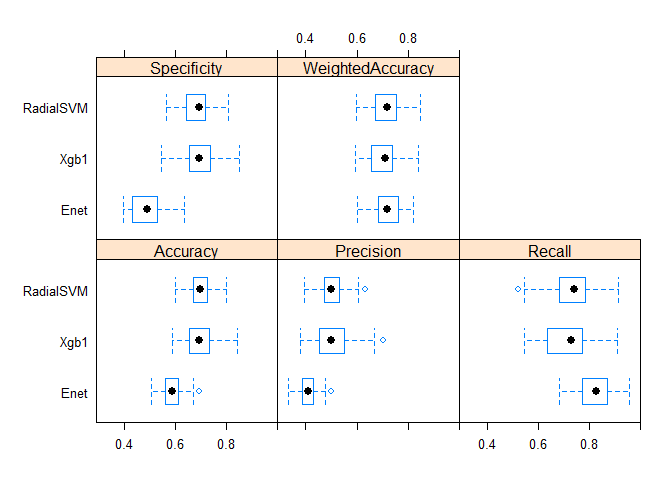
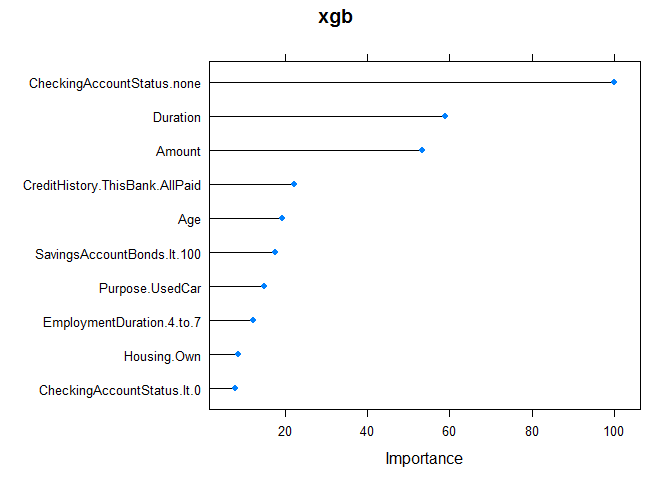
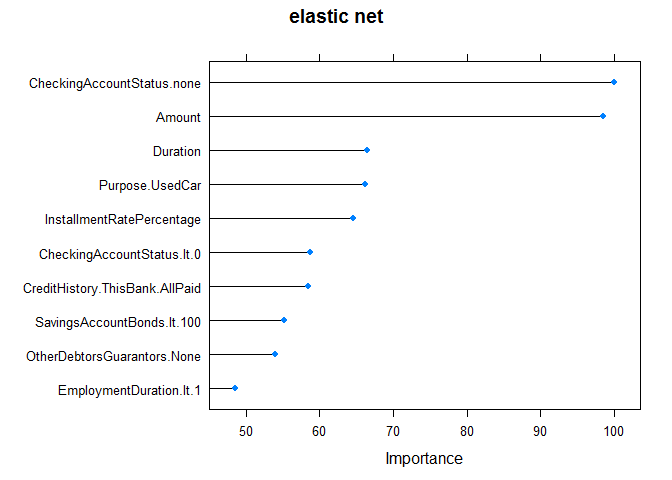
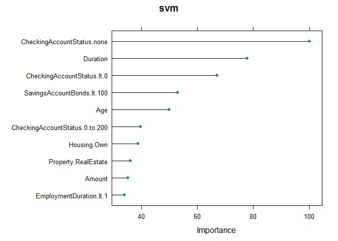

German Credit Classification
================

This document demonstrates using machine learning models to classify bank loans into good or bad loans according to some client-specific attributes. The data used is the Statlog German Credit Data, a data set frequently studied in machine learning.

I trained three first-level models using support vector machine with gaussian kernel, gradient boosted decision tree and elastic net. These three first-level models are then blended together using logistic regression to create the final model

A weighted accuracy that takes into account the cost matrix that comes with the data is used to measure the performance of the models.

Using a particular seed, the 10-fold cross-validation estimate of the weighted accuracy of the model is 0.74. The unweighted accuracy is 0.76. Precision and recall are respectively around 0.6 and 0.7.

### Data pre-processing

The version of the German Credit Data included in R's default data sets is already one-hot encoded. This data set includes 61 predictors and 1 output (Good or Bad). In the pre-processing step, I eliminated the linearly dependent predictors and the near zero and zero-variance predictors. The rest of the predictors are scaled and centered before being used.

``` r
library(caret)
```

    ## Loading required package: lattice

    ## Loading required package: ggplot2

``` r
library(corrplot)
data(GermanCredit)
# check if missing data
any(sapply(GermanCredit,function(x)length(which(is.na(x)==T)))!=0)
```

    ## [1] FALSE

``` r
X <- GermanCredit[,-10]
Y <- GermanCredit[,10]

#### Delete linearly dependent ####
X_ldinfo <- findLinearCombos(X)
X <- X[,-X_ldinfo$remove]

#### Preprocess control ####
preproc <- c("nzv","zv","scale","center")
```

### Define a custom performance metric

While the goal is to predict the nature of the loans (good loan or bad loan) as accurately as possible, it seems clear that erroneously predicting a risky (bad) loan as good loan entails more serious consequences than the other way around. This fact is reflected in the cost matrix that comes with the data set. The cost matrix looks like the following where the rows are the actual outputs and the columns, the predictions.

``` r
cost_m <- matrix(c(0,1,5,0),ncol=2,byrow=TRUE)
colnames(cost_m) <- c("Good","Bad")
rownames(cost_m) <- c("Good","Bad")
cost_m <- as.table(cost_m)
cost_m
```

    ##      Good Bad
    ## Good    0   1
    ## Bad     5   0

To take into account the different costs associated with the two types of error, I created a weighed accuracy which is equivalent to giving 5 times more weights to the positive cases. Note that the positive cases here refer to the bad loans since they are cases where the symptom (loan default) is present. This weighted accuracy is used to choose the hyperparameters and to evaluate the model performance.

``` r
weightedAccu <- function(obs,pred,positive,false_pos_cost,false_neg_cost) {
return(1-(sum(ifelse(obs==positive,
                     false_neg_cost*(obs!=pred),
                     false_pos_cost*(obs!=pred)))/
            (sum(obs==positive)*false_neg_cost+sum(obs!=positive))))  
}

customM <- function(data, lev = NULL, model = NULL) {
  accu_w <- weightedAccu(obs=data[,"obs"],pred=data[,"pred"],
                         positive="Bad",
                         false_pos_cost=1,
                         false_neg_cost=5)
  accu <- mean(data[, "obs"]==data[, "pred"])
  precis <- (sum(data[, "pred"]=="Bad"&data[, "obs"]=="Bad")/sum(data[, "pred"]=="Bad"))
  recall <- (sum(data[, "pred"]=="Bad"&data[, "obs"]=="Bad")/sum(data[, "obs"]=="Bad"))
  c(WeightedAccuracy=accu_w,Accuracy= accu,Precision= precis,Recall= recall)
}
```

### Training control

The German credit Data is unbalanced. Only 30% of the observations are bad loans. Up-sampling the data is one way to compensate for this imbalance so that the models trained on the data set will be able to learn the characteristics of both types of loans.

``` r
#### Training control ####
fitControl<- trainControl(
  method = "cv",
  number=10,
  summaryFunction=customM)

fitControlUp <- trainControl(
  method = "cv",
  number = 10,
  sampling="up",
  summaryFunction=customM)
```

### Data spliting

I split the data into a training set and a "blending" set (which is actually another training set). Given the small size of the data set, I did not save any additional data for testing but used directly the cross-validation estimates. As suggested in *Applied Predictive Modeling*, "when the number of samples is not large, a strong case can be made that a test set should be avoided because every sample may be needed for model building. Additionally, the size of the test set may not have sufficient power or precision to make reasonable judgements.(...)Resampling methods, such as cross-validation, can be used to produce appropriate estimates of model performance using the training set."

For reproducibility, a seed is set for data splitting and cross-validation in this document. In real training, I believe it is better to do without seeds so that the trained first-level models will be more heterogeneous due to the different training and validation set choice in the cross-validation step.

``` r
seed <- 3000
set.seed(seed)
Train_indx <- createDataPartition(GermanCredit$Class,p=.75,list=F)
Data_train <- cbind(X[Train_indx,],Class=Y[Train_indx])
Data_blend <- cbind(X[-Train_indx,],Class=Y[-Train_indx])
```

### First-level models training

I chose three models that are based on different principles in the hope that they will produce heterogeneous results which will be more useful when blended together.

Support vector machine does classification by finding an optimal hyperplane that separates the data with the largest margin. The trained model will be determined only by a subset of the whole data used in training. These data points that really "matter" to the model are the support vectors. They are data points that either sit on the boundary of the hyperplane or cross the boundary (misclassified points, we are of course talking about soft margin SVM here). Gradient boosted decision tree is an aggregation of many individually weak decision trees. An individual decision tree classifies by finding recursively an optimal cut point in one of the predictors. The optimal cut point is a value such that when splitting the data into two according to this value, the outcome (label) of the data in the same group are as homogenous as possible. The aggregation is done such that the base models (here, decision trees) are added one at a time to minimize some kinds of loss function. Finally, elastic net is just a general linear model with a mixed amount of L1 and L2 regularization.

The codes below train the three models on the training set.

``` r
#### SVM radial  ####
set.seed(seed)
#svmgrid <- expand.grid(C=seq(0.1,3,0.2),
#                       sigma=seq(0.01,0.1,0.02))
svmradial<-  train(Class ~ ., data = Data_train, 
                   method = "svmRadial",
                   trControl=fitControlUp,
                   preProcess= preproc,
                   #tuneGrid=svmgrid,
                   metric="WeightedAccuracy")
```

    ## Loading required package: kernlab

    ## 
    ## Attaching package: 'kernlab'

    ## The following object is masked from 'package:ggplot2':
    ## 
    ##     alpha

``` r
#### Gradient boosting ####
set.seed(seed)
xgb<-  train(Class ~ ., data = Data_train, 
             method = "xgbTree",
             preProcess=preproc,
             trControl=fitControlUp,
             metric="WeightedAccuracy")
```

    ## Loading required package: xgboost

    ## Loading required package: plyr

``` r
#### Elastic net ####
set.seed(seed)
enetgrid <-  expand.grid(alpha= seq(0.1,1,0.05),
                        lambda=seq(0.01,0.1,0.01))

enet<-  train(Class ~ ., data = Data_train, 
              method = "glmnet",
              preProcess=preproc,
              trControl=fitControlUp,
              tuneGrid= enetgrid,
              metric="WeightedAccuracy")
```

    ## Loading required package: glmnet

    ## Loading required package: Matrix

    ## Loading required package: foreach

    ## Loaded glmnet 2.0-10

### Base models comparison

We can compare the 10 most important predictors of the six models. Checking account statut (no checking account) and the duration in month appear to be the most important predictors across models.

``` r
plot(varImp(svmradial),top="10",main="svm")
```



``` r
plot(varImp(xgb),top="10",main="xgb")
```



``` r
plot(varImp(enet),top="10",main="elastic net")
```



The following plot shows us the correlations between the three models. More the model are uncorrelated, more the blending at the second level will be useful. It can be notice that the results of the three first-level models are actually highly correlated most of the time.

Highly correlated predictors in logistic regression make the coefficient estimate of the individual predictors unreliable but do not influence the predictive power of the model as a whole. Since we are using logistic regression to blend the first-level models only to increase the predictive power and that we are not interested in how each of the first-level models contributes to the final model, this should not be a problem here.

``` r
modelList <- list(RadialSVM=svmradial,
                 Xgb1 =xgb,
                 Enet=enet)
resamps<- resamples(modelList)
corrplot(modelCor(resamps),method="number")
```



### Final model

The predictions of the base models on the blending set are put together with the output to be used to train the final model using logistic regression. Note that the data set used to blend the models here is not up-sampled as it was with the data used to train the first-level models This is because I want to use cross-validation to estimate the performance of the final model so I want the data to be as close as possible to what the model would see "in the wild".

``` r
basemodel <- lapply(modelList,predict,newdata=Data_blend)
Data_ensem<- do.call(cbind.data.frame, basemodel)
Data_ensem$Class <- Data_blend$Class
set.seed(seed)
blend<-  train(Class ~ ., data = Data_ensem, 
                    method = "glm",
                    trControl=fitControl)
blend$results
```

    ##   parameter WeightedAccuracy  Accuracy Precision    Recall
    ## 1      none        0.7493359 0.7686026 0.6253571 0.7339286
    ##   WeightedAccuracySD AccuracySD PrecisionSD  RecallSD
    ## 1         0.06698768 0.08943276   0.1326408 0.1062963

We can compare the performance of the final model shown above with a baseline model which classifies all loans as good. Since about 0.7 of the data are good loans, the baseline model would achieve a 0.7 unweighted accuracy. But if we take into account the cost matrix, the baseline model will have a weighted accuracy of 0.32.

Here, our final model has a cross-validation weighted accuracy of 0.74 and unweighted accuracy of 0.76. Precision and recall are respectively around 0.6 and 0.7. Note that the results are susceptible to change when a different seed or no seed is used. However, for most of the time, the final model represents a significant improvement compared to the baseline model. This is especially in terms of weighted accuracy.

### Reference

-   Kuhn Max, Johnson Kjell (2013). Applied predictive Modelling. Springer.
